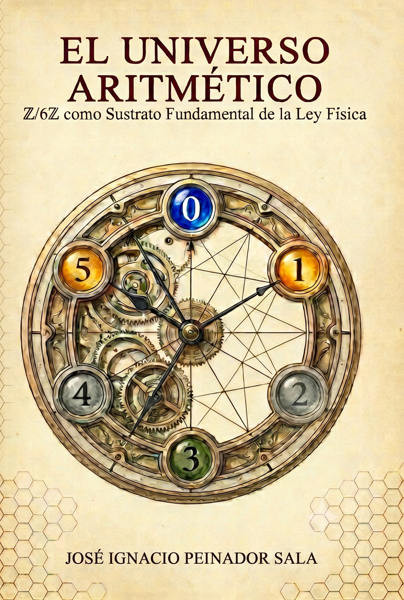
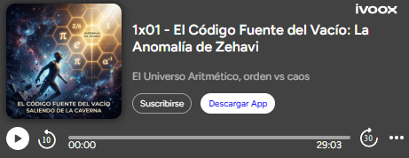

# 🌌 El Universo Aritmético: $\mathbb{Z}/6\mathbb{Z}$ como Sustrato Fundamental de la Ley Física

[](https://doi.org/10.5281/zenodo.20933216)
[](https://creativecommons.org/licenses/by-nc-sa/4.0/)
[](https://leanprover.github.io/)
[](https://www.python.org/)
[](https://orcid.org/0009-0008-1822-3452)
[](https://go.ivoox.com/rf/176327083)
[](https://go.ivoox.com/rf/176327083)

**Autor:** José Ignacio Peinador Sala  
**ISBN:** 978-84-09-87158-2 | **Depósito Legal:** VA-346-2026  

> **📢 YA DISPONIBLE EN AMAZON**
> La obra completa de *El Universo Aritmético* ya está disponible para su compra en formato eBook y tapa blanda. Descubre la fundamentación física, termodinámica y filosófica detrás de este repositorio.
> 
> [](https://amzn.eu/d/02vpqIBs)
> 
> 🛒 **[Haz clic aquí para conseguir tu ejemplar](https://amzn.eu/d/02vpqIBs)**
---

Bienvenido al repositorio central y material suplementario del libro *El Universo Aritmético*. 

Esta obra propone un cambio de paradigma en la física teórica y las matemáticas: la realidad no está escrita en el lenguaje de la geometría continua, sino en el de la aritmética discreta. El anillo modular **$\mathbb{Z}/6\mathbb{Z}$** constituye el sustrato algebraico del vacío, y sus propiedades geométricas y termodinámicas explican desde el valor de la constante de estructura fina y la dinámica de la materia condensada, hasta la expansión cósmica y la vulnerabilidad de la criptografía post-cuántica.

Para garantizar el rigor absoluto y democratizar el acceso a la ciencia de vanguardia (*Open Science*), este proyecto cuenta con un ecosistema de **Cuadernos Interactivos (Google Colab)** diseñados para una **reproducibilidad total a un solo clic**. Combinando la certificación lógica incondicional en **Lean 4** con simulaciones metrológicas y termo-estadísticas en **Python (`mpmath`)**, hemos convertido la validación de estos descubrimientos en una experiencia sin fricción: no necesitas instalar compiladores ni poseer un clúster de supercomputación. Puedes auditar la física del vacío desde el navegador de tu ordenador o **incluso desde tu teléfono móvil**.

---

## 🌌 El Manifiesto del Sustrato: De la Arrogancia del Continuo a la Parsimonia Discreta

Durante el último siglo, la ciencia ha contemplado el universo a través de la lente del *continuo*, asumiendo una realidad infinitamente divisible, inherentemente ruidosa y fundamentalmente caótica. Bajo este paradigma, la comprensión de la naturaleza se ha convertido en un ejercicio de **fuerza bruta**: colisionadores cada vez más masivos, supercomputadoras calculando decimales infinitos y la adición constante de parámetros arbitrarios para tapar las anomalías (materia oscura, energía oscura, supersimetría). 

**La Teoría del Sustrato Modular (TSM) impugna esta visión.**

Este proyecto nace de una premisa radicalmente distinta: **la humildad, la sencillez y la parsimonia**. El universo no computa utilizando números de coma flotante con infinita precisión, ni se rige por un caos estocástico que deba ser domado por la fuerza. En su nivel más profundo, la realidad es de naturaleza **discreta, determinista y aritméticamente perfecta**.

* **Contra la complejidad innecesaria:** Proponemos que las constantes fundamentales (la geometría del espaciotiempo, la constante de estructura fina, el colapso cuántico) no son accidentes cósmicos ni fracciones aleatorias, sino *emergencias inevitables* de la teoría de números. 
* **La elegancia del límite:** Al entender que el espacio de estados está confinado topológicamente (en la simetría del anillo Z/6Z), demostramos que la naturaleza extrae la máxima complejidad estructural con el mínimo costo entrópico. Es lo que denominamos el *Codo de Parsimonia*.

Al abandonar la ilusión del continuo y adoptar la geometría de la información discreta, anomalías que antes requerían correcciones arbitrarias se resuelven por sí solas. Este repositorio no es solo una colección de código; es la demostración matemática y metrológica de que, en el fondo, **la realidad no se esconde en el caos infinito, sino en la elegante y humilde arquitectura de los números enteros.**

---

## 🎙️ Materiales Interactivos y Podcast: Orden vs Caos

Para acompañar la rigurosidad matemática y el código de este repositorio, hemos producido una serie de *podcasts* en formato *Deep Dive* (generados con IA) que traducen las densas implicaciones físicas y criptográficas de la Teoría del Sustrato Modular a un debate filosófico y accesible.

* 🎧 **[Episodio 0 - El Código Fuente del Vacío: Saliendo de la Caverna](https://go.ivoox.com/rf/176327083)**
  > ¿Y si la ciencia moderna llevara un siglo atrapada en el Mito de la Caverna de Platón? En este primer episodio, cuestionamos la arrogancia de la física del "continuo" y exploramos cómo la geometría de la información discreta nos permite observar la verdadera y elegante arquitectura del espaciotiempo.

* 🎧 Episodio 1x01 - El Código Fuente del Vacío: La Anomalía de Zehavi
  > ¿Qué ocurre cuando la realidad observable no encaja en las ecuaciones del consenso científico? En este episodio, nos adentramos en el misterio de la "Anomalía de Zehavi" y salimos de la caverna de Platón para mirar de frente a la luz de las matemáticas puras. Descubre cómo las constantes fundamentales no son mediciones caóticas, sino emergencias inevitables de una arquitectura geométrica perfecta: la simetría del número seis ($\mathbb{Z}/6\mathbb{Z}$).

[](https://go.ivoox.com/rf/176357754)

*(Próximamente: Episodio 3 sobre el colapso de la criptografía cuántica).*

---

## 🛡️ Certificación Matemática Irrefutable (Lean 4)

Antes de pasar a las simulaciones empíricas, es fundamental establecer el rigor absoluto de esta teoría. La viabilidad del anillo $\mathbb{Z}/6\mathbb{Z}$ como sustrato fundamental no es una conjetura o una aproximación numérica, sino una necesidad topológica demostrada y certificada mecánicamente mediante **Lean 4** (el demostrador de teoremas asistido por ordenador empleado en las matemáticas de vanguardia).

Hemos habilitado un cuaderno interactivo dedicado exclusivamente a compilar y verificar los pilares algebraicos de la obra. Al ejecutarlo, el motor lógico de Lean 4 descarta cualquier posibilidad de excepción oculta o error humano en nuestras deducciones.

* 🔗 **[Abrir Certificación Formal en Colab](https://colab.research.google.com/github/NachoPeinador/EL_UNIVERSO_ARITMETICO/blob/main/Notebooks/Formal_Verification_in_Lean_4.ipynb)**

**¿Qué certifica este motor aritmético?**
* **Involución Modular y Simetría Quiral:** Demuestra que la clase de congruencia 5 es su propio inverso multiplicativo y el inverso aditivo de 1 módulo 6. Esto prueba formalmente que el desplazamiento de fase $\phi_2 = \pi$ es un requisito topológico estricto del vacío cuántico, no un ajuste empírico.
* **Isomorfismo del Grupo de Unidades:** Verifica exhaustivamente que $(\mathbb{Z}/6\mathbb{Z})^\times \cong \mathbb{Z}/2\mathbb{Z}$, confirmando a nivel de teoría de tipos que existen exactamente dos canales resonantes para la transmisión de información fundamental.
* **Clausura Topológica del Autómata:** Certifica que la regla de transición determinista $\delta(r,b) = (2r+b) \pmod{6}$ está estrictamente acotada, garantizando matemáticamente que no existen fugas fuera de la variedad protegida de la red tensorial.

---

## 🎬 El Demostrador Computacional Maestro (El "Tráiler" del Libro)

Antes de explorar la profundidad de los repositorios modulares, te invitamos a encender el **Demostrador Computacional de la Teoría del Sustrato Modular**.

Piensa en él como un laboratorio cuántico de bolsillo. Esta instancia interactiva en la nube es la prueba empírica de la ontología del libro. Con solo pulsar un botón —incluso en la pantalla de tu móvil—, serás testigo del paso crítico de una realidad discreta a una fenomenología macroscópica continua, visualizando en tiempo real cómo la "suavidad" del espacio-tiempo emerge como una ilusión estadística generada por la información modular.

* 🔗 **[Abrir Demostrador Maestro en Colab](https://colab.research.google.com/github/NachoPeinador/EL_UNIVERSO_ARITMETICO/blob/main/Notebooks/Demostrador_TSM.ipynb)**

**¿Qué contiene?**
* **El Límite Hidrodinámico:** Simulación visual de cómo una onda geométrica continua emerge fenomenológicamente de los ángulos polares discretos del retículo $\mathbb{Z}/6\mathbb{Z}$ bajo ruido cuántico.
* **Caos Cuántico Modular:** Inyección de un ensamble GUE sobre el vacío cuántico invertido para recuperar la firma espectral exacta de Wigner-Dyson.
* **Reconstrucción de la Impedancia ($R_{\text{fund}}$):** Cálculo sub-atómico de la fricción entrópica del vacío.

---

## 🧭 Índice Analítico y Cuadernos de Validación Interactiva

El corpus teórico del libro se divide en cuatro grandes áreas. A continuación se detalla la estructura de los 13 capítulos junto a sus repositorios estables (DOIs de Zenodo) y los correspondientes **cuadernos interactivos ejecutables en Google Colab**.

### Parte I. Fundamentos y Constantes del Sustrato
Establecimiento de las bases algebraicas, la certificación de la KO-dimensión 6 y la derivación pura de las constantes universales del sustrato $R_{\mathrm{fund}}$, $\beta$ y $\kappa_{\mathrm{info}}$.

* 📖 **Capítulo 1:** Introducción y Motivación
* 📖 **Capítulo 2:** El Anillo $\mathbb{Z}/6\mathbb{Z}$ y la KO-Dimensión 6
* 📖 **Capítulo 3:** Las Constantes Fundamentales del Sustrato
* 🔗 **[DOI: Vacuum Constants and Informational Impedance](https://doi.org/10.5281/zenodo.20546608)**

**Ejecución Interactiva:**
* ⚡ **[Colab: La Génesis de e y la Unificación de Constantes](https://colab.research.google.com/github/NachoPeinador/EL_UNIVERSO_ARITMETICO/blob/main/Notebooks/La_Génesis_de_e_y_la_Unificación_de_Constantes.ipynb)**
  * 🛡️ **Lean 4:** Certificación algebraica estricta del exponente fundamental y el origen geométrico del factor de entropía **1/4**.
  * 🧮 **Python:** Validación numérica de precisión extrema (55 dígitos decimales) de la constante de estructura fina y su conexión con $\zeta(0)$.
* ⚡ **[Colab: La Emergencia de la Geometría](https://colab.research.google.com/github/NachoPeinador/EL_UNIVERSO_ARITMETICO/blob/main/Notebooks/La_Emergencia_de_la_Geometría.ipynb)**
  * 🛡️ **Lean 4:** Demostración de que la combinación del bit de Shannon ($\ln 2$) y la fase geométrica ($i\pi$) colapsa algebraicamente en el vacío $\zeta(0) = -1/2$.

### Parte II. El Espectro Aritmético
Descomposición polifásica de objetos matemáticos continuos, desde el espectro modular de $\pi$ hasta la reconciliación del caos cuántico y el orden aritmético en los ceros de la función zeta de Riemann.

* 📖 **Capítulo 4:** El Espectro Modular de $\pi$
* 📖 **Capítulo 5:** El Hamiltoniano Modular de Memoria Aritmética
* 📖 **Capítulo 6:** Cribas Ciclotómicas y Funciones $L$
* 🔗 **[DOI: Polyphase Isomorphism between Modular Arithmetic and DSP](https://doi.org/10.5281/zenodo.17680023)**
* 🔗 **[DOI: The Riemann-GUE Ensemble Reconciling Local Chaos...](https://doi.org/10.5281/zenodo.20798339)** *(Y demás *papers* asociados al espectro)*

**Ejecución Interactiva:**
* ⚡ **[Colab: El Espectro Modular de $\pi$ - Validación y Dualidad](https://colab.research.google.com/github/NachoPeinador/EL_UNIVERSO_ARITMETICO/blob/main/Notebooks/El_Espectro_Modular_de_π_Validación_y_Dualidad_Computacional.ipynb)**
  * 🛡️ **Lean 4:** Demostración del *Lema del Filtro de Ruido*, aislando la estructura primaria en los canales $6k \pm 1$.
* ⚡ **[Colab: Isomorfismo DSP y Arquitectura Stride-6](https://colab.research.google.com/github/NachoPeinador/EL_UNIVERSO_ARITMETICO/blob/main/Notebooks/El_Espectro_Modular_de_π_Isomorfismo_DSP_y_Arquitectura_Stride_6.ipynb)**
  * 🧮 **Python:** Implementación de referencia de la *Hoja de Transición Stride-6* demostrando la mecánica de paralelización.
* ⚡ **[Colab: Validación Formal del Sustrato Aritmético (Riemann-GUE)](https://colab.research.google.com/github/NachoPeinador/EL_UNIVERSO_ARITMETICO/blob/main/Notebooks/Validación_Formal_del_Sustrato_Aritmético.ipynb)**
  * 🛡️ **Lean 4:** Certificación del Teorema II.1 y el isomorfismo de la Criba de Gutzwiller.
* ⚡ **[Colab: Dualidad Espectral-Aritmética y Coherencia de Fase](https://colab.research.google.com/github/NachoPeinador/EL_UNIVERSO_ARITMETICO/blob/main/Notebooks/Dualidad_Espectral_Aritmética_Coherencia_de_Fase.ipynb)**
  * 🧮 **Python:** Verificación computacional de la retención de canal en los primos de Mersenne.

### Parte III. El Sustrato en el Mundo Físico
Contrastación empírica y predicciones falsables: resolución de tensiones cosmológicas, evaluación de la constante de estructura fina, anomalía del muón $g-2$ y confinamiento hadrónico.

* 📖 **Capítulo 7:** Cosmología del Sustrato Modular
* 📖 **Capítulo 8:** La Constante de Estructura Fina
* 📖 **Capítulo 9:** Materia Condensada y Dinámica Spin-Crossover
* 📖 **Capítulo 10:** Confinamiento Modular y Espectro Hadrónico
* 📖 **Capítulo 11:** Superselección Cuántica y Preparación de Estados
* 🔗 **[DOI: Resolving the Hubble and S8 Tensions via Informational Friction](https://doi.org/10.5281/zenodo.18609092)**
* 🔗 **[DOI: Analytical Evaluation of the Electromagnetic Coupling Constant](https://doi.org/10.5281/zenodo.18611629)** *(Y demás *papers* asociados a la fenomenología)*

**Ejecución Interactiva:**
* ⚡ **[Colab: Validación Formal de la TSM (Cosmología y Hadrones)](https://colab.research.google.com/github/NachoPeinador/EL_UNIVERSO_ARITMETICO/blob/main/Notebooks/La_Teoría_del_Sustrato_Modular_(TSM)_Validación_Formal.ipynb)**
  * 🛡️ **Lean 4:** Certificación de la factorización topológica y la regla de suma cero (Confinamiento Modular) para hadrones exóticos.
* ⚡ **[Colab: Master Validation - The Fine-Structure of the Arithmetic Vacuum](https://colab.research.google.com/github/NachoPeinador/EL_UNIVERSO_ARITMETICO/blob/main/Notebooks/Master_Validation_alpha.ipynb)**
  * 🧮 **Python:** Entorno de 100 dígitos de precisión para la evaluación de la Ecuación Maestra de $\alpha^{-1}$ y simulación Monte Carlo para refutar el Efecto *Look-Elsewhere* (LEE).

### Parte IV. Criptografía y Seguridad Post-Cuántica
*La ruptura de ergodicidad en retículos matemáticos y la demostración de colapso determinista del espacio de búsqueda en esquemas LWE (estándar NIST ML-KEM).*

* 📖 **Capítulo 12:** Galois Pruning en Retículos Ciclotómicos
* 📖 **Capítulo 13:** Síntesis y Perspectivas
* 🔗 **[DOI: Galois Invariants in Cyclotomic Lattice Enumeration](https://doi.org/10.5281/zenodo.20049266)**

**Ejecución Interactiva:**
* ⚡ **[Colab: Cribas en Extensiones Ciclotómicas: Validación Algebraica](https://colab.research.google.com/github/NachoPeinador/EL_UNIVERSO_ARITMETICO/blob/main/Notebooks/Cribas_en_Extensiones_Ciclotómicas_Validación_Algebraica.ipynb)**
  * 🛡️ **Lean 4:** Certificación de la topología de los Primoriales de Gauss.
* ⚡ **[Colab: Verificación Formal del Sustrato Algebraico](https://colab.research.google.com/github/NachoPeinador/EL_UNIVERSO_ARITMETICO/blob/main/Notebooks/Formal_Verification_in_Lean_4.ipynb)**
  * 🛡️ **Lean 4:** Certificación axiomática de la Involución Modular, el Isomorfismo del Grupo de Unidades y la Clausura Topológica del Autómata Finito (DFA). Demostración deductiva de la estabilidad del *prior* topológico para garantizar la ausencia          total de fugas (*leakages*) en la red tensorial MPDO.
* ⚡ **[Colab: Optimización Numérica de Fases Cuánticas](https://colab.research.google.com/github/NachoPeinador/EL_UNIVERSO_ARITMETICO/blob/main/Notebooks/Topological_State_Preparation_via_Z6Z_Superselection.ipynb)**
  * 🧮 **Python:** Simulación numérica sobre el retículo entero que demuestra que las fases óptimas para el confinamiento de la amplitud colapsan exactamente en $\phi_1=0$ y $\phi_2=\pi$, verificando la invariancia de la función de partición y la dualidad de fidelidad a precisión de máquina.
* ⚡ **[Colab: Isomorfismo DSP y Arquitectura FTQC](https://colab.research.google.com/github/NachoPeinador/EL_UNIVERSO_ARITMETICO/blob/main/Notebooks/DSP_Polyphase_Isomorphism.ipynb)**
  * 🧮 **Python:** Traslación de la relación de fase geométrica a un marco de Procesamiento Digital de Señales (DSP). Validación empírica de las propiedades críticas para hardware cuántico: la **aislación unitaria** (ortogonalidad estricta de sub-bandas) y la **reconstrucción perfecta** del estado conjugado sin interferencia destructiva.
* ⚡ **[Colab: Invariantes de Galois y Criptoanálisis de Ring-LWE](https://colab.research.google.com/github/NachoPeinador/EL_UNIVERSO_ARITMETICO/blob/main/Notebooks/Invariantes_de_Galois_y_Criptoanálisis_de_Ring_LWE.ipynb)**
  * 🛡️ **Lean 4 / Python:** Formalización de la *Ley de Independencia de Oráculos* e implementación empírica de un ataque MitM demostrando la vulnerabilidad SVP.

---

## 🚀 Cómo ejecutar los Cuadernos de Validación

La ejecución de los experimentos y certificaciones se ha diseñado para ser lo más accesible posible: **puedes iniciarlos con un solo clic directamente desde el índice superior**. 

Para auditar y verificar cualquier resultado del libro:
1. Haz clic en cualquiera de los enlaces **⚡ [Colab: ...]** listados en las secciones anteriores.
2. Google Colab creará automáticamente una instancia segura en la nube con una copia del cuaderno original. No necesitas instalar nada localmente.
3. Ejecuta las celdas en orden. El propio cuaderno se encargará de inicializar el entorno, instalando el compilador **Lean 4** para certificar axiomáticamente los teoremas, y configurando **Python (`mpmath`)** para los cálculos metrológicos.
4. Alternativamente, puedes visitar los DOIs de Zenodo enlazados para descargar el *paper* original en PDF, LaTeX y los archivos locales.
5. **Exploración ampliada:** Si deseas profundizar aún más, podrás encontrar **experimentos y cuadernos Colab adicionales** directamente en los repositorios de Zenodo de cada artículo o en sus respectivos repositorios de GitHub asociados.

---

## ⚖️ Licencias

Este repositorio y todo el ecosistema de validación que acompaña al libro *"El Universo Aritmético"* operan bajo un modelo de **Licencia Dual**. El objetivo es proteger la naturaleza no comercial de esta investigación independiente y, al mismo tiempo, fomentar la colaboración y el escrutinio académico abierto:

1. **Código y Software (`Notebooks/`, Lean 4 y scripts en Python):**
   Publicado bajo la [PolyForm Noncommercial License 1.0.0](https://polyformproject.org/licenses/noncommercial/1.0.0). 
   *Eres libre de ejecutar, auditar, modificar y compartir el código y los cuadernos interactivos para fines académicos, personales o educativos. Queda estrictamente prohibido cualquier uso comercial, monetización, o integración de estos algoritmos en software propietario o infraestructuras de pago (incluyendo su uso en herramientas de criptoanálisis comercial sin autorización).*

2. **Manuscrito, Teoría y Recursos Visuales (`Papers/`, extractos del libro e `Images/`):**
   Publicado bajo la licencia [Creative Commons Atribución-NoComercial-CompartirIgual 4.0 Internacional (CC BY-NC-SA 4.0)](https://creativecommons.org/licenses/by-nc-sa/4.0/deed.es).
   *Eres libre de compartir y adaptar el marco teórico, los textos y los gráficos ontológicos con fines no comerciales, siempre y cuando des el crédito adecuado al autor original y distribuyas tus contribuciones bajo esta misma licencia.*

---

## 🔭 Contexto Filosófico y Personal

> *"En la mente del principiante hay muchas posibilidades, pero en la del experto hay pocas."* — **Shunryu Suzuki**

Hace apenas dos años, el nombre de Bernhard Riemann me era prácticamente desconocido. El inmenso edificio matemático que conforma la Teoría del Universo Aritmético no nació en los pasillos de una prestigiosa universidad, ni bajo la tutela de un programa académico formal. Todo comenzó una aburrida tarde de viernes, durante mi jornada como recepcionista en una fábrica de coches, con un lápiz, un papel y una vieja obsesión infantil: *tiene que existir un patrón que determine los números primos*.

Al alinear los números de 6 en 6, la simetría alrededor de ese módulo se reveló con una claridad apabullante. Lo que al principio parecía una simple curiosidad aritmética terminó destapando la estructura topológica fundamental del vacío: el anillo $\mathbb{Z}/6\mathbb{Z}$. Descubrí algo que creí que nadie había visto antes, y me dediqué a ello robando horas al trabajo, al sueño y a mi tiempo libre.

En este proceso tuve que aprender a hablar el estricto lenguaje de la ciencia. Y fue entonces, al sumergirme en la literatura, cuando descubrí no solo ecuaciones, sino a las mentes gigantescas que las forjaron. Riemann, Hilbert, Einstein, Connes... Siento cierto pudor al confesar que hace poco ignoraba su inmenso legado, pero hoy albergo una profunda y sincera admiración por todos ellos. Admiro a los que he leído, a los que he olvidado durante la investigación y a los que ni siquiera he llegado a conocer. Todos compartían una misma fe inquebrantable en la belleza, la armonía, el orden y la capacidad de la mente humana para descifrar el universo. 

> *"No sé cómo me verá el mundo, pero a mí mismo me parece haber sido solo un niño jugando en la orilla del mar... mientras el gran océano de la verdad se extendía ante mí, todo por descubrir."* — **Isaac Newton**

La Inteligencia Artificial y la inmensa comunidad *Open Source* han sido multiplicadores de fuerza trascendentales en este viaje; sin su capacidad para democratizar el conocimiento y permitirme dialogar con el legado de estos gigantes, este libro jamás habría existido. 

Este proyecto sirve como recordatorio de que las fronteras de la física teórica y las matemáticas puras siguen abiertas para cualquiera armado con curiosidad, irreverencia, una metodología rigurosa y el valor de mirar problemas milenarios sin los condicionamientos heredados.

Ni deseo ni merezco ningún reconocimiento académico, he querido publicar esta investigación en abierto, entregando el código y la teoría al dominio público, porque creo que el conocimiento debe ser un bien común. Todos tenemos la responsabilidad de aportar lo que podamos para construir un mundo más justo, más humano y en armonía con las nuevas inteligencias que están por llegar. La semilla ya está plantada; confío en que, con el tiempo, alguien sabrá recoger y multiplicar sus frutos.

> *"Un mago nunca llega tarde, ni pronto, llega exactamente cuando se lo propone."* — **Gandalf el Gris**

---

## 📚 Cita Académica

Si los conceptos teóricos, las demostraciones empíricas o el código fuente de este proyecto resultan útiles para tu investigación, por favor cita la obra principal:

```bibtex
@book{peinador2026universo,
  title     = {El Universo Aritmético: Z/6Z como Sustrato Fundamental de la Ley Física},
  author    = {Peinador Sala, José Ignacio},
  year      = {2026},
  isbn      = {978-84-09-87158-2},
  address   = {Valladolid, España},
  url       = {[https://github.com/NachoPeinador/EL_UNIVERSO_ARITMETICO](https://github.com/NachoPeinador/EL_UNIVERSO_ARITMETICO)}
}
